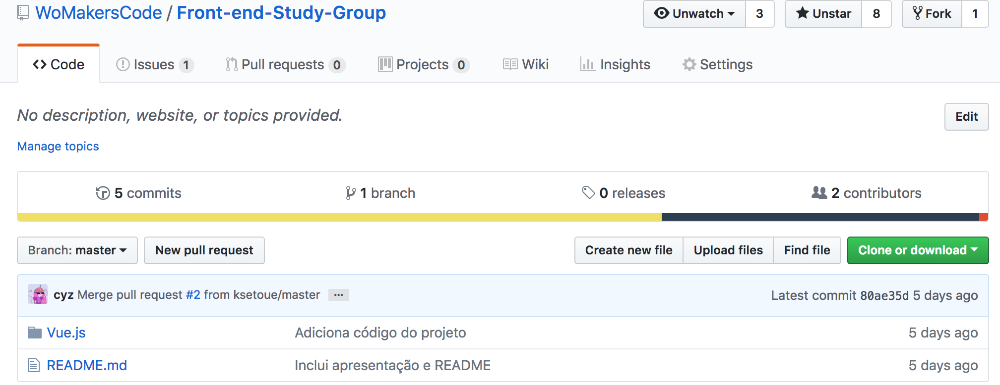

# Repositório

## Criar um repositório

É possível versionar um projeto através de um repositório, que em seu computador, basicamente, será uma pasta que terá todos os arquivos do seu projeto. 

```bash
$ git init
```

Este comando, irá criar uma pasta `.git`na raiz do projeto e nela, ficarão registradas as informações relacionadas ao controle do versionamento.

## Conectar um repositório local com a nuvem do GitHub

Se você já está trabalhando em um projeto que ainda não está versionado, você  pode criar um repositório no GitHub e conectar seus arquivos locais com o GitHub. Para adicionar o rastreamento remoto, use o comando `git remote add`no terminal, no diretório em que seu repositório está armazenado.

```javascript
/* navegando até a pasta */
$ cd nomedaminhapasta 

/* estando dentro da pasta do projeto, indique a URL */
$ git remote add origin https://github.com/user/repo.git

/* verificando a origem adicionada ao repositório */
$ git remote -v

/* Retorno esperado */
origin  https://github.com/user/repo.git (fetch)
origin  https://github.com/user/repo.git (push)
```

## Clonar um repositório já existente

Clonar um repositório já existente é, literalmente, fazer uma cópia dele em sua máquina local. No caso a seguir, vamos clonar um repositório remoto \(que está na nuvem do GitHub\). 

1. Na página da Web do [repositório](https://github.com/WoMakersCode/Front-end-Study-Group), clique no botão verde "clone or download", no lado direito da página.



2.  Selecione a opção "Usar HTTPS" - se estiver disponível - e copie o link.

3. No Terminal, navegue até sua pasta de desenvolvimento.


Nota: Se você não tiver uma pasta de desenvolvimento, pode ser uma boa idéia criar uma onde você pode armazenar todos os diretórios rastreados pelo `git` em um só lugar.


No tutorial, vou navegar até minha área de trabalho \(Desktop\) e criar uma pasta nova, no momento que estiver clonando o repositório. Para isso, logo após a URL do repositório no GitHub, vou adicionar o nome da pasta.

```bash
$ cd Desktop
$ git clone https://github.com/WoMakersCode/Front-end-Study-Group.git nomedanovapasta 
```


