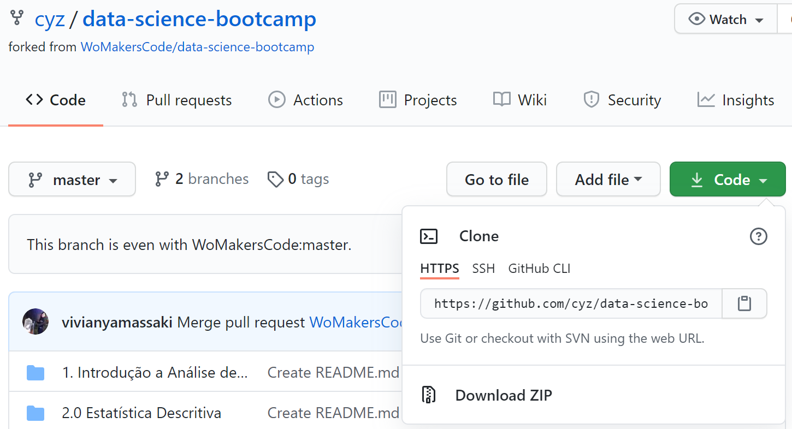

# Hands-on: Como fazer um fork e contribuir com outros projetos

Um fork do GitHub é uma cópia de um repositório (repo) que fica em sua conta. Depois de fazer um fork (bifurcar) um repositório, você poderá editar o conteúdo de seu repositório bifurcado sem afetar o repositório principal. Quando desejar, poderá enviar suas alterações para o repositório principal.

## Criando o fork

Supondo que você esteja usando o GitHub, essa etapa é fácil. Apenas encontre o repositório para o qual você está contribuindo e pressione o botão Fork no canto superior esquerdo. Isso criará uma cópia exata do repositório (e todos os seus ramos) com seu próprio nome de usuário.


## Clonando o repositório bifurcado

O GitHub o redirecionará automaticamente para o repositório bifurcado com o seu nome de usuário. Este é o repositório que você precisa para clonar em seu ambiente de desenvolvimento local, não o original. Pegue a URL fornecida pelo GitHub no botão verde "Clonar ou Baixar" e conecte-a ao comando abaixo.



```
git clone https://github.com/cyz/data-science-bootcamp.git
```